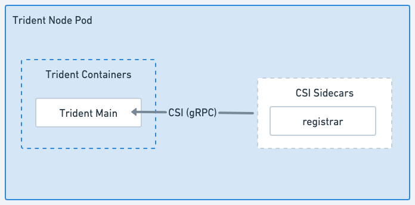

= A arquitetura do Astra Trident
:hardbreaks:
:allow-uri-read: 
:icons: font
:imagesdir: ../media/

[role="lead"]
O Astra Trident é executado como um único Pod de controladora e um pod de nó em cada nó de trabalho no cluster. O pod de nó deve estar em execução em qualquer host onde você queira potencialmente montar um volume Astra Trident.

== Compreensão dos pods dos nós e dos pods do controlador

O Astra Trident é implantado como <<Pod do controlador Trident>>um único e um ou mais <<Pods do nó Trident>> no cluster Kubernetes e usa contentores padrão do Kubernetes _CSI Sidecar_ para simplificar a implantação de plug-ins do CSI. link:https://kubernetes-csi.github.io/docs/sidecar-containers.html["Kubernetes CSI Sidecar contêineres"^] São mantidos pela comunidade do Kubernetes Storage.

Kubernetes link:https://kubernetes.io/docs/concepts/scheduling-eviction/assign-pod-node/["seletores de nós"^] e link:https://kubernetes.io/docs/concepts/scheduling-eviction/taint-and-toleration/["tolerações e taints"^]são usados para restringir um pod a ser executado em um nó específico ou preferencial. Você pode configurar seletores de nós e tolerâncias para pods de nó e controlador durante a instalação do Astra Trident.

* O plugin controlador lida com o provisionamento e gerenciamento de volume, como snapshots e redimensionamento.
* O plug-in do nó manipula a conexão do armazenamento ao nó.

.Astra Trident implantado no cluster Kubernetes
image::../media/trident-arch.png[Diagrama da arquitetura Astra Trident no cluster Kubernetes.]

=== Pod do controlador Trident

O Pod do controlador Trident é um único Pod que executa o plug-in do controlador CSI.

* Responsável pelo provisionamento e gerenciamento de volumes no storage NetApp
* Gerenciado por uma implantação do Kubernetes
* Pode ser executado no plano de controle ou nos nós de trabalho, dependendo dos parâmetros de instalação.

.Diagrama do pod do controlador Trident
image::../media/controller-pod.png[Diagrama do Pod do controlador Trident que executa o plug-in do controlador CSI com sidecars CSI aplicáveis.]

=== Pods do nó Trident

Os pods de nó Trident são pods privilegiados que executam o plug-in do nó CSI.

* Responsável pela montagem e desmontagem do armazenamento dos pods em execução no host
* Gerenciado por um DaemonSet Kubernetes
* Deve ser executado em qualquer nó que montar o storage NetApp

.Diagrama do pod do nó Trident

== Arquiteturas de cluster Kubernetes compatíveis

O Astra Trident é compatível com as seguintes arquiteturas de Kubernetes:

[cols="3,1,2"]
|===
| Arquiteturas de cluster do Kubernetes | Suportado | Instalação predefinida 

| Único mestre, computação | Sim  a| 
Sim

| Mestre múltiplo, computação | Sim  a| 
Sim

| Mestre `etcd`, , computação | Sim  a| 
Sim

| Mestre, infraestrutura, computação | Sim  a| 
Sim

|===