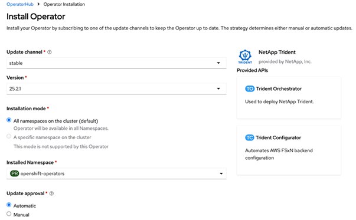

= Instale o Trident usando o OpenShift OperatorHub
:hardbreaks:
:allow-uri-read: 
:icons: font
:imagesdir: ../media/

[role="lead"]
Se você usar o Red Hat OpenShift, você pode instalar o NetApp Trident usando o operador certificado Red Hat. Use este procedimento para instalar o Trident a partir da Plataforma de contêiner do Red Hat OpenShift.

.Antes de começar
Antes de iniciar a instalação, link:../trident-get-started/requirements.html["Prepare seu ambiente para a instalação do Trident"].

== Localize e instale o operador Trident

.Passos
. Navegue até o OpenShift OperatorHub e procure por NetApp Trident.
+
image::../media/openshift-operator-01.png[Operador Trident]

. Clique em * NetApp Trident* para abrir as configurações de instalação.
. Selecione as opções necessárias e clique em *Instalar* para abrir a configuração do Operador.
+
image::../media/openshift-operator-02.png[Instale]

+

NOTE: Certifique-se de selecionar a versão mais recente do Operator.

. Mantenha todos os parâmetros como estão e clique em *Instalar*.
+

+
Quando a instalação estiver concluída, o Operador ficará visível na lista de operadores instalados e estará pronto para uso.

. Clique em *Exibir Operador* para visualizar os detalhes do Operador.
+
image::../media/openshift-operator-04.png[Instalado]

. Em * Trident Orchestrator*, clique em *Criar instância*.
+
image::../media/openshift-operator-07.png[Instalado]

. Clique em *Visualização YAML* e cole o seguinte no formulário:
+
[source, yaml]
----
apiVersion: trident.netapp.io/v1
kind: TridentOrchestrator
metadata:
  name: trident
  namespace: openshift-operators
spec:
  IPv6: false
  debug: false
  nodePrep:
  - iscsi
  imageRegistry: ''
  k8sTimeout: 30
  namespace: trident
  silenceAutosupport: false
----
+
[]
====
** O Red Hat Enterprise Linux CoreOS (RHCOS) não tem o iSCSI habilitado e configurado.
** Você pode adicionar o `nodePrep` parâmetro para configurar e habilitar os serviços iSCSI e Multipath em todos os nós de trabalho do OpenShift.
** A partir do OpenShift 4.19, a versão mínima do Trident suportada para esse recurso é 25.06.1.

====
. Clique em *Criar*; o Trident Orchestrator será totalmente instalado.
+
image::../media/openshift-operator-08.png[Instalado]

== Desinstalar operador Trident

.Passos
. Selecione o operador Trident na lista de operador instalado.
. Selecione se pretende eliminar toda a instância do operador.
+

WARNING: Se você não selecionar a caixa de seleção *Excluir todas as instâncias operand deste operador*, o Trident não será desinstalado.

. Clique em *Desinstalar*.

