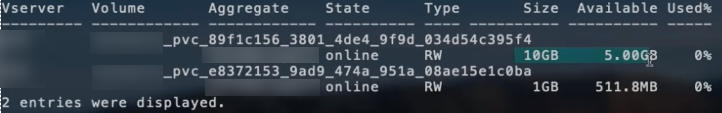

= Exemplos e opções de configuração do ONTAP nas
:hardbreaks:
:allow-uri-read: 
:icons: font
:imagesdir: ../media/

[role="lead"]
Aprenda a criar e usar drivers ONTAP nas com sua instalação do Trident. Esta seção fornece exemplos de configuração de back-end e detalhes para mapear backends para StorageClasses.

== Opções de configuração de back-end

Consulte a tabela a seguir para obter as opções de configuração de back-end:

[cols="1,3,2"]
|===
| Parâmetro | Descrição | Padrão 

| `version` |  | Sempre 1 

| `storageDriverName` | Nome do controlador de armazenamento | "ONTAP-nas", "ONTAP-nas-economy", "ONTAP-nas-FlexGroup", "ONTAP-san", "ONTAP-san-economy" 

| `backendName` | Nome personalizado ou back-end de storage | Nome do driver e dataLIF 

| `managementLIF` | Endereço IP de um cluster ou LIF de gerenciamento de SVM Um nome de domínio totalmente qualificado (FQDN) pode ser especificado. Pode ser definido para usar endereços IPv6 se o Trident tiver sido instalado usando o sinalizador IPv6. Os endereços IPv6 devem ser definidos entre colchetes, como `[28e8:d9fb:a825:b7bf:69a8:d02f:9e7b:3555]` . Para o switchover MetroCluster otimizado, consulte o <<mcc-best>>. | "10,0.0,1", "[2001:1234:abcd::fefe]" 

| `dataLIF` | Endereço IP do protocolo LIF. Recomendamos especificar `dataLIF`. Se não for fornecido, o Trident obtém LIFs de dados do SVM. Você pode especificar um nome de domínio totalmente qualificado (FQDN) a ser usado para as operações de montagem NFS, permitindo que você crie um DNS de round-robin para balanceamento de carga em vários LIFs de dados. Pode ser alterado após a definição inicial. Consulte a . Pode ser definido para usar endereços IPv6 se o Trident tiver sido instalado usando o sinalizador IPv6. Os endereços IPv6 devem ser definidos entre colchetes, como `[28e8:d9fb:a825:b7bf:69a8:d02f:9e7b:3555]` . *Omita para MetroCluster.* Consulte <<mcc-best>>. | Endereço especificado ou derivado do SVM, se não for especificado (não recomendado) 

| `svm` | Máquina virtual de armazenamento para usar *omit for MetroCluster.* Consulte <<mcc-best>>. | Derivado se uma SVM `managementLIF` for especificada 

| `autoExportPolicy` | Ativar a criação e atualização automática da política de exportação [Boolean]. Usando as `autoExportPolicy` opções e `autoExportCIDRs`, o Trident pode gerenciar políticas de exportação automaticamente. | falso 

| `autoExportCIDRs` | Lista de CIDR para filtrar IPs de nós do Kubernetes quando `autoExportPolicy` está ativado. Usando as `autoExportPolicy` opções e `autoExportCIDRs`, o Trident pode gerenciar políticas de exportação automaticamente. | ["0,0.0,0/0", "::/0"]» 

| `labels` | Conjunto de rótulos arbitrários formatados em JSON para aplicar em volumes | "" 

| `clientCertificate` | Valor codificado em base64 do certificado do cliente. Usado para autenticação baseada em certificado | "" 

| `clientPrivateKey` | Valor codificado em base64 da chave privada do cliente. Usado para autenticação baseada em certificado | "" 

| `trustedCACertificate` | Valor codificado em base64 do certificado CA confiável. Opcional. Usado para autenticação baseada em certificado | "" 

| `username` | Nome de usuário para se conetar ao cluster/SVM. Usado para autenticação baseada em credenciais |  

| `password` | Senha para se conectar ao cluster/SVM. Usado para autenticação baseada em credenciais |  

| `storagePrefix`  a| 
Prefixo usado ao provisionar novos volumes na SVM. Não pode ser atualizado depois de configurá-lo

NOTE: Ao usar o ONTAP-nas-economy e um storagePreFIX que tenha 24 ou mais carateres, o qtrees não terá o prefixo de armazenamento incorporado, embora esteja no nome do volume.
| "Trident" 

| `aggregate`  a| 
Agregado para provisionamento (opcional; se definido, deve ser atribuído ao SVM). Para `ontap-nas-flexgroup` o driver, essa opção é ignorada. Se não for atribuído, qualquer um dos agregados disponíveis poderá ser usado para provisionar um volume FlexGroup.

NOTE: Quando o agregado é atualizado no SVM, ele é atualizado automaticamente no Trident polling SVM sem ter que reiniciar a controladora Trident. Quando você tiver configurado um agregado específico no Trident para provisionar volumes, se o agregado for renomeado ou movido para fora do SVM, o back-end mudará para o estado com falha no Trident durante a pesquisa do agregado SVM. Você precisa alterar o agregado para um que esteja presente no SVM ou removê-lo completamente para colocar o back-end on-line.
 a| 
""

| `limitAggregateUsage` | Falha no provisionamento se o uso estiver acima dessa porcentagem. *Não se aplica ao Amazon FSX for ONTAP* | "" (não aplicado por padrão) 

| FlexgroupAggregateList  a| 
Lista de agregados para provisionamento (opcional; se definida, deve ser atribuída ao SVM). Todos os agregados atribuídos ao SVM são usados para provisionar um volume FlexGroup. Suportado para o driver de armazenamento *ONTAP-nas-FlexGroup*.

NOTE: Quando a lista de agregados é atualizada no SVM, a lista é atualizada automaticamente no Trident polling SVM sem ter que reiniciar o controlador Trident. Quando você tiver configurado uma lista de agregados específica no Trident para provisionar volumes, se a lista de agregados for renomeada ou movida para fora do SVM, o back-end passará para o estado com falha no Trident durante a consulta do agregado SVM. Você precisa alterar a lista de agregados para uma que esteja presente no SVM ou removê-la completamente para colocar o back-end on-line.
| "" 

| `limitVolumeSize` | Falha no provisionamento se o tamanho do volume solicitado estiver acima desse valor. Também restringe o tamanho máximo dos volumes que gerencia para qtrees, e a `qtreesPerFlexvol` opção permite personalizar o número máximo de qtrees por FlexVol. | "" (não aplicado por padrão) 

| `debugTraceFlags` | Debug flags para usar ao solucionar problemas. Por exemplo, não use `debugTraceFlags` a menos que você esteja solucionando problemas e exija um despejo de log detalhado. | nulo 

| `nasType` | Configurar a criação de volumes NFS ou SMB. As opções são `nfs`, `smb` ou null. A configuração como null padrão para volumes NFS. | `nfs` 

| `nfsMountOptions` | Lista separada por vírgulas de opções de montagem NFS. As opções de montagem para volumes persistentes do Kubernetes normalmente são especificadas em classes de armazenamento, mas se nenhuma opção de montagem for especificada em uma classe de armazenamento, o Trident voltará a usar as opções de montagem especificadas no arquivo de configuração do back-end de armazenamento. Se nenhuma opção de montagem for especificada na classe de armazenamento ou no arquivo de configuração, o Trident não definirá nenhuma opção de montagem em um volume persistente associado. | "" 

| `qtreesPerFlexvol` | Qtrees máximos por FlexVol, têm de estar no intervalo [50, 300] | "200" 

| `smbShare` | Você pode especificar uma das seguintes opções: O nome de um compartilhamento SMB criado usando o Console de Gerenciamento da Microsoft ou a CLI do ONTAP; um nome para permitir que o Trident crie o compartilhamento SMB; ou você pode deixar o parâmetro em branco para impedir o acesso comum ao compartilhamento a volumes. Esse parâmetro é opcional para o ONTAP no local. Esse parâmetro é necessário para backends do Amazon FSX for ONTAP e não pode ficar em branco. | `smb-share` 

| `useREST` | Parâmetro booleano para usar APIs REST do ONTAP.  `useREST` Quando definido como `true`, o Trident usa APIs REST do ONTAP para se comunicar com o back-end; quando definido como `false`, o Trident usa chamadas ZAPI do ONTAP para se comunicar com o back-end. Esse recurso requer o ONTAP 9.11,1 e posterior. Além disso, a função de login do ONTAP usada deve ter acesso ao `ontap` aplicativo. Isso é satisfeito com as funções e `cluster-admin` predefinidas `vsadmin`. Começando com a versão Trident 24,06 e ONTAP 9.15,1 ou posterior, `userREST` é definido como `true` por padrão; altere `useREST` para para `false` usar chamadas ONTAP ZAPI. | `true` Para ONTAP 9.15,1 ou posterior, caso contrário `false`. 

| `limitVolumePoolSize` | Tamanho máximo de FlexVol requestable ao usar Qtrees no back-end ONTAP-nas-Economy. | "" (não aplicado por padrão) 

| `denyNewVolumePools` | Restringe `ontap-nas-economy` backends de criar novos volumes do FlexVol para conter suas Qtrees. Somente Flexvols pré-existentes são usados para provisionar novos PVS. |  
|===

== Opções de configuração de back-end para volumes de provisionamento

Você pode controlar o provisionamento padrão usando essas opções na `defaults` seção da configuração. Para obter um exemplo, consulte os exemplos de configuração abaixo.

[cols="1,3,2"]
|===
| Parâmetro | Descrição | Padrão 

| `spaceAllocation` | Alocação de espaço para Qtrees | "verdadeiro" 

| `spaceReserve` | Modo de reserva de espaço; "nenhum" (fino) ou "volume" (grosso) | "nenhum" 

| `snapshotPolicy` | Política de instantâneos a utilizar | "nenhum" 

| `qosPolicy` | Grupo de políticas de QoS a atribuir aos volumes criados. Escolha uma das qosPolicy ou adaptiveQosPolicy por pool de armazenamento/backend | "" 

| `adaptiveQosPolicy` | Grupo de políticas de QoS adaptável a atribuir para volumes criados. Escolha uma das qosPolicy ou adaptiveQosPolicy por pool de armazenamento/backend. Não suportado pela ONTAP-nas-Economy. | "" 

| `snapshotReserve` | Porcentagem de volume reservado para snapshots | "0" se `snapshotPolicy` for "nenhum", caso contrário "" 

| `splitOnClone` | Divida um clone de seu pai na criação | "falso" 

| `encryption` | Ative a criptografia de volume do NetApp (NVE) no novo volume; o padrão é `false`. O NVE deve ser licenciado e habilitado no cluster para usar essa opção. Se NAE estiver ativado no back-end, qualquer volume provisionado no Trident será NAE habilitado. Para obter mais informações, consulte: link:../trident-reco/security-reco.html["Como o Trident funciona com NVE e NAE"]. | "falso" 

| `tieringPolicy` | Política de disposição em camadas para usar "nenhuma" | "Somente snapshot" para configuração pré-ONTAP 9.5 SVM-DR 

| `unixPermissions` | Modo para novos volumes | "777" para volumes NFS; vazio (não aplicável) para volumes SMB 

| `snapshotDir` | Controla o acesso ao `.snapshot` diretório | "Verdadeiro" para NFSv4 "falso" para NFSv3 

| `exportPolicy` | Política de exportação a utilizar | "predefinição" 

| `securityStyle` | Estilo de segurança para novos volumes. Estilos de segurança e `unix` suporte de NFS `mixed`. Suporta SMB `mixed` e `ntfs` estilos de segurança. | O padrão NFS é `unix`. O padrão SMB é `ntfs`. 

| `nameTemplate` | Modelo para criar nomes de volume personalizados. | "" 
|===

NOTE: O uso de grupos de política de QoS com Trident requer o ONTAP 9.8 ou posterior. Você deve usar um grupo de políticas de QoS não compartilhado e garantir que o grupo de políticas seja aplicado individualmente a cada componente. Um grupo de políticas de QoS compartilhado impõe o limite máximo da taxa de transferência total de todos os workloads.

=== Exemplos de provisionamento de volume

Aqui está um exemplo com padrões definidos:

[listing]
----
---
version: 1
storageDriverName: ontap-nas
backendName: customBackendName
managementLIF: 10.0.0.1
dataLIF: 10.0.0.2
labels:
  k8scluster: dev1
  backend: dev1-nasbackend
svm: trident_svm
username: cluster-admin
password: <password>
limitAggregateUsage: 80%
limitVolumeSize: 50Gi
nfsMountOptions: nfsvers=4
debugTraceFlags:
  api: false
  method: true
defaults:
  spaceReserve: volume
  qosPolicy: premium
  exportPolicy: myk8scluster
  snapshotPolicy: default
  snapshotReserve: '10'

----
Para `ontap-nas` e `ontap-nas-flexgroups`, o Trident agora usa um novo cálculo para garantir que o FlexVol seja dimensionado corretamente com a porcentagem de snapshotServe e PVC. Quando o usuário solicita um PVC, o Trident cria o FlexVol original com mais espaço usando o novo cálculo. Esse cálculo garante que o usuário receba o espaço gravável que solicitou no PVC, e não menor espaço do que o que solicitou. Antes de v21,07, quando o usuário solicita um PVC (por exemplo, 5GiB), com o snapshotServe a 50 por cento, eles recebem apenas 2,5GiBMB de espaço gravável. Isso ocorre porque o que o usuário solicitou é todo o volume e `snapshotReserve` é uma porcentagem disso. Com o Trident 21,07, o que o usuário solicita é o espaço gravável e o Trident define o `snapshotReserve` número como a porcentagem de todo o volume. Isto não se aplica `ontap-nas-economy` ao . Veja o exemplo a seguir para ver como isso funciona:

O cálculo é o seguinte:

[listing]
----
Total volume size = (PVC requested size) / (1 - (snapshotReserve percentage) / 100)
----
Para snapshotServe de 50%, e a solicitação de PVC de 5GiB, o volume total é de 2/.5 10GiB e o tamanho disponível é de 5GiB, o que o usuário solicitou na solicitação de PVC. O `volume show` comando deve mostrar resultados semelhantes a este exemplo:

Os backends existentes de instalações anteriores provisionarão volumes conforme explicado acima ao atualizar o Trident. Para volumes que você criou antes da atualização, você deve redimensionar seus volumes para que a alteração seja observada. Por exemplo, um PVC de 2GiB mm com `snapshotReserve=50` anterior resultou em um volume que fornece 1GiB GB de espaço gravável. Redimensionar o volume para 3GiB, por exemplo, fornece ao aplicativo 3GiBMB de espaço gravável em um volume de 6 GiB.

== Exemplos mínimos de configuração

Os exemplos a seguir mostram configurações básicas que deixam a maioria dos parâmetros padrão. Esta é a maneira mais fácil de definir um backend.

NOTE: Se você estiver usando o Amazon FSX no NetApp ONTAP com Trident, a recomendação é especificar nomes DNS para LIFs em vez de endereços IP.

.Exemplo de economia nas do ONTAP
[%collapsible]
====
[listing]
----
---
version: 1
storageDriverName: ontap-nas-economy
managementLIF: 10.0.0.1
dataLIF: 10.0.0.2
svm: svm_nfs
username: vsadmin
password: password
----
====
.Exemplo de ONTAP nas FlexGroup
[%collapsible]
====
[listing]
----
---
version: 1
storageDriverName: ontap-nas-flexgroup
managementLIF: 10.0.0.1
dataLIF: 10.0.0.2
svm: svm_nfs
username: vsadmin
password: password
----
====
.Exemplo de MetroCluster
[#mcc-best%collapsible]
====
Você pode configurar o back-end para evitar ter que atualizar manualmente a definição do back-end após o switchover e o switchback durante link:../trident-reco/backup.html#svm-replication-and-recovery["Replicação e recuperação da SVM"]o .

Para comutação e switchback contínuos, especifique o SVM usando `managementLIF` e omite os `dataLIF` parâmetros e. `svm` Por exemplo:

[listing]
----
---
version: 1
storageDriverName: ontap-nas
managementLIF: 192.168.1.66
username: vsadmin
password: password
----
====
.Exemplo de volumes SMB
[%collapsible]
====
[listing]
----

---
version: 1
backendName: ExampleBackend
storageDriverName: ontap-nas
managementLIF: 10.0.0.1
nasType: smb
securityStyle: ntfs
unixPermissions: ""
dataLIF: 10.0.0.2
svm: svm_nfs
username: vsadmin
password: password
----
====
.Exemplo de autenticação baseada em certificado
[%collapsible]
====
Este é um exemplo de configuração de back-end mínimo. `clientCertificate`, `clientPrivateKey` E `trustedCACertificate` (opcional, se estiver usando CA confiável) são preenchidos `backend.json` e recebem os valores codificados em base64 do certificado do cliente, da chave privada e do certificado de CA confiável, respetivamente.

[listing]
----
---
version: 1
backendName: DefaultNASBackend
storageDriverName: ontap-nas
managementLIF: 10.0.0.1
dataLIF: 10.0.0.15
svm: nfs_svm
clientCertificate: ZXR0ZXJwYXB...ICMgJ3BhcGVyc2
clientPrivateKey: vciwKIyAgZG...0cnksIGRlc2NyaX
trustedCACertificate: zcyBbaG...b3Igb3duIGNsYXNz
storagePrefix: myPrefix_
----
====
.Exemplo de política de exportação automática
[%collapsible]
====
Este exemplo mostra como você pode instruir o Trident a usar políticas de exportação dinâmicas para criar e gerenciar a política de exportação automaticamente. Isso funciona da mesma forma para os `ontap-nas-economy` drivers e `ontap-nas-flexgroup`.

[listing]
----
---
version: 1
storageDriverName: ontap-nas
managementLIF: 10.0.0.1
dataLIF: 10.0.0.2
svm: svm_nfs
labels:
  k8scluster: test-cluster-east-1a
  backend: test1-nasbackend
autoExportPolicy: true
autoExportCIDRs:
- 10.0.0.0/24
username: admin
password: password
nfsMountOptions: nfsvers=4
----
====
.Exemplo de endereços IPv6
[%collapsible]
====
Este exemplo mostra `managementLIF` usando um endereço IPv6.

[listing]
----
---
version: 1
storageDriverName: ontap-nas
backendName: nas_ipv6_backend
managementLIF: "[5c5d:5edf:8f:7657:bef8:109b:1b41:d491]"
labels:
  k8scluster: test-cluster-east-1a
  backend: test1-ontap-ipv6
svm: nas_ipv6_svm
username: vsadmin
password: password
----
====
.Exemplo do Amazon FSX para ONTAP usando volumes SMB
[%collapsible]
====
O `smbShare` parâmetro é necessário para o FSX for ONTAP usando volumes SMB.

[listing]
----
---
version: 1
backendName: SMBBackend
storageDriverName: ontap-nas
managementLIF: example.mgmt.fqdn.aws.com
nasType: smb
dataLIF: 10.0.0.15
svm: nfs_svm
smbShare: smb-share
clientCertificate: ZXR0ZXJwYXB...ICMgJ3BhcGVyc2
clientPrivateKey: vciwKIyAgZG...0cnksIGRlc2NyaX
trustedCACertificate: zcyBbaG...b3Igb3duIGNsYXNz
storagePrefix: myPrefix_
----
====
.Exemplo de configuração de backend com nameTemplate
[%collapsible]
====
[listing]
----
---
version: 1
storageDriverName: ontap-nas
backendName: ontap-nas-backend
managementLIF: <ip address>
svm: svm0
username: <admin>
password: <password>
defaults: {
    "nameTemplate": "{{.volume.Name}}_{{.labels.cluster}}_{{.volume.Namespace}}_{{.volume.RequestName}}"
},
"labels": {"cluster": "ClusterA", "PVC": "{{.volume.Namespace}}_{{.volume.RequestName}}"}
----
====

== Exemplos de backends com pools virtuais

Nos arquivos de definição de back-end de exemplo mostrados abaixo, padrões específicos são definidos para todos os pools de armazenamento, como `spaceReserve` em nenhum, `spaceAllocation` em falso e `encryption` em falso. Os pools virtuais são definidos na seção armazenamento.

O Trident define rótulos de provisionamento no campo "Comentários". Os comentários são definidos no FlexVol for `ontap-nas` ou no FlexGroup `ontap-nas-flexgroup` for . O Trident copia todas as etiquetas presentes em um pool virtual para o volume de storage no provisionamento. Por conveniência, os administradores de storage podem definir rótulos por pool virtual e volumes de grupo por rótulo.

Nesses exemplos, alguns dos pools de armazenamento definem seus próprios `spaceReserve` `spaceAllocation` valores , e `encryption` , e alguns pools substituem os valores padrão.

.Exemplo de ONTAP nas
[%collapsible%open]
====
[listing]
----
---
version: 1
storageDriverName: ontap-nas
managementLIF: 10.0.0.1
svm: svm_nfs
username: admin
password: <password>
nfsMountOptions: nfsvers=4
defaults:
  spaceReserve: none
  encryption: 'false'
  qosPolicy: standard
labels:
  store: nas_store
  k8scluster: prod-cluster-1
region: us_east_1
storage:
- labels:
    app: msoffice
    cost: '100'
  zone: us_east_1a
  defaults:
    spaceReserve: volume
    encryption: 'true'
    unixPermissions: '0755'
    adaptiveQosPolicy: adaptive-premium
- labels:
    app: slack
    cost: '75'
  zone: us_east_1b
  defaults:
    spaceReserve: none
    encryption: 'true'
    unixPermissions: '0755'
- labels:
    department: legal
    creditpoints: '5000'
  zone: us_east_1b
  defaults:
    spaceReserve: none
    encryption: 'true'
    unixPermissions: '0755'
- labels:
    app: wordpress
    cost: '50'
  zone: us_east_1c
  defaults:
    spaceReserve: none
    encryption: 'true'
    unixPermissions: '0775'
- labels:
    app: mysqldb
    cost: '25'
  zone: us_east_1d
  defaults:
    spaceReserve: volume
    encryption: 'false'
    unixPermissions: '0775'
----
====
.Exemplo de ONTAP nas FlexGroup
[%collapsible%open]
====
[listing]
----
---
version: 1
storageDriverName: ontap-nas-flexgroup
managementLIF: 10.0.0.1
svm: svm_nfs
username: vsadmin
password: <password>
defaults:
  spaceReserve: none
  encryption: 'false'
labels:
  store: flexgroup_store
  k8scluster: prod-cluster-1
region: us_east_1
storage:
- labels:
    protection: gold
    creditpoints: '50000'
  zone: us_east_1a
  defaults:
    spaceReserve: volume
    encryption: 'true'
    unixPermissions: '0755'
- labels:
    protection: gold
    creditpoints: '30000'
  zone: us_east_1b
  defaults:
    spaceReserve: none
    encryption: 'true'
    unixPermissions: '0755'
- labels:
    protection: silver
    creditpoints: '20000'
  zone: us_east_1c
  defaults:
    spaceReserve: none
    encryption: 'true'
    unixPermissions: '0775'
- labels:
    protection: bronze
    creditpoints: '10000'
  zone: us_east_1d
  defaults:
    spaceReserve: volume
    encryption: 'false'
    unixPermissions: '0775'
----
====
.Exemplo de economia nas do ONTAP
[%collapsible%open]
====
[listing]
----
---
version: 1
storageDriverName: ontap-nas-economy
managementLIF: 10.0.0.1
svm: svm_nfs
username: vsadmin
password: <password>
defaults:
  spaceReserve: none
  encryption: 'false'
labels:
  store: nas_economy_store
region: us_east_1
storage:
- labels:
    department: finance
    creditpoints: '6000'
  zone: us_east_1a
  defaults:
    spaceReserve: volume
    encryption: 'true'
    unixPermissions: '0755'
- labels:
    protection: bronze
    creditpoints: '5000'
  zone: us_east_1b
  defaults:
    spaceReserve: none
    encryption: 'true'
    unixPermissions: '0755'
- labels:
    department: engineering
    creditpoints: '3000'
  zone: us_east_1c
  defaults:
    spaceReserve: none
    encryption: 'true'
    unixPermissions: '0775'
- labels:
    department: humanresource
    creditpoints: '2000'
  zone: us_east_1d
  defaults:
    spaceReserve: volume
    encryption: 'false'
    unixPermissions: '0775'
----
====

== Mapeie os backends para StorageClasses

As seguintes definições do StorageClass referem-se <<Exemplos de backends com pools virtuais>>a . Usando o `parameters.selector` campo, cada StorageClass chama quais pools virtuais podem ser usados para hospedar um volume. O volume terá os aspetos definidos no pool virtual escolhido.

* O `protection-gold` StorageClass será mapeado para o primeiro e segundo pool virtual `ontap-nas-flexgroup` no back-end. Estas são as únicas piscinas que oferecem proteção de nível de ouro.
+
[listing]
----
apiVersion: storage.k8s.io/v1
kind: StorageClass
metadata:
  name: protection-gold
provisioner: csi.trident.netapp.io
parameters:
  selector: "protection=gold"
  fsType: "ext4"
----
* O `protection-not-gold` StorageClass será mapeado para o terceiro e quarto pool virtual no `ontap-nas-flexgroup` back-end. Estas são as únicas piscinas que oferecem um nível de proteção diferente do ouro.
+
[listing]
----
apiVersion: storage.k8s.io/v1
kind: StorageClass
metadata:
  name: protection-not-gold
provisioner: csi.trident.netapp.io
parameters:
  selector: "protection!=gold"
  fsType: "ext4"
----
* O `app-mysqldb` StorageClass será mapeado para o quarto pool virtual `ontap-nas` no back-end. Este é o único pool que oferece configuração de pool de armazenamento para o aplicativo tipo mysqldb.
+
[listing]
----
apiVersion: storage.k8s.io/v1
kind: StorageClass
metadata:
  name: app-mysqldb
provisioner: csi.trident.netapp.io
parameters:
  selector: "app=mysqldb"
  fsType: "ext4"
----
* O `protection-silver-creditpoints-20k` StorageClass será mapeado para o terceiro pool virtual no `ontap-nas-flexgroup` back-end. Esta é a única piscina que oferece proteção de nível de prata e 20000 pontos de crédito.
+
[listing]
----
apiVersion: storage.k8s.io/v1
kind: StorageClass
metadata:
  name: protection-silver-creditpoints-20k
provisioner: csi.trident.netapp.io
parameters:
  selector: "protection=silver; creditpoints=20000"
  fsType: "ext4"
----
* O `creditpoints-5k` StorageClass será mapeado para o terceiro pool virtual `ontap-nas` no back-end e o segundo pool virtual `ontap-nas-economy` no back-end. Estas são as únicas ofertas de pool com 5000 pontos de crédito.
+
[listing]
----
apiVersion: storage.k8s.io/v1
kind: StorageClass
metadata:
  name: creditpoints-5k
provisioner: csi.trident.netapp.io
parameters:
  selector: "creditpoints=5000"
  fsType: "ext4"
----

O Trident decidirá qual pool virtual é selecionado e garante que o requisito de armazenamento seja atendido.

== Atualização `dataLIF` após a configuração inicial

Você pode alterar o LIF de dados após a configuração inicial executando o seguinte comando para fornecer o novo arquivo JSON de back-end com LIF de dados atualizado.

[listing]
----
tridentctl update backend <backend-name> -f <path-to-backend-json-file-with-updated-dataLIF>
----

NOTE: Se os PVCs estiverem anexados a um ou vários pods, você deverá reduzir todos os pods correspondentes e restaurá-los para que o novo LIF de dados entre em vigor.
